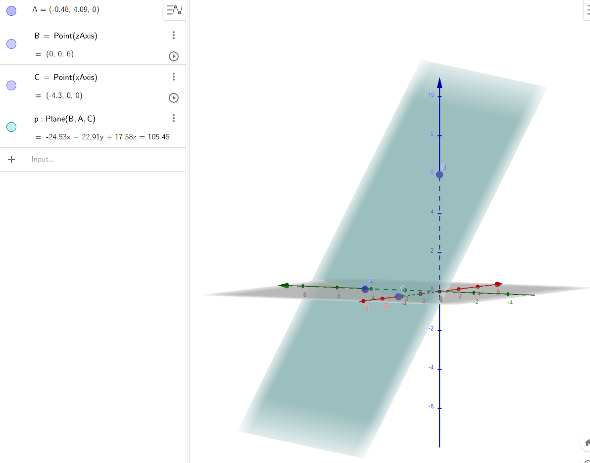

# About
Created this project to play around with the new 3d math libraries present in .NET 7.

We will shoot multiple rays into the 3d world and test for collisions.
Below is Plane 1 (Image generated by https://www.geogebra.org/classic/3d):

## Requirements

This project requires .NET 7
